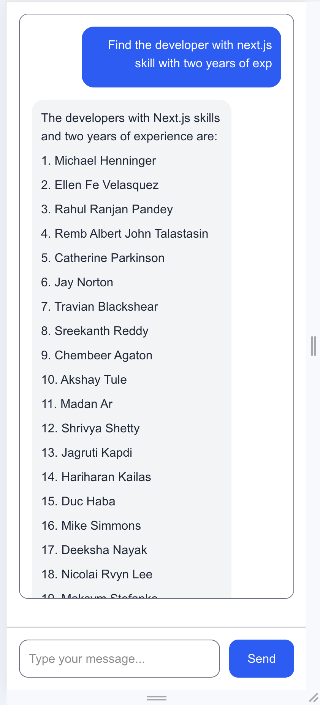

# Getting Started

### Airtable AI POC Chat

This web application allows you to interact with an LLM (Large Language Model) and the Airtable API to retrieve candidate information based on specific queried skill sets. The application is built using Next.js and leverages the Ollama model through function tools to facilitate communication between the app, the Llama model, and the Airtable API.

## Overview

In this application, you can:

- Query the Airtable database for candidates with specific skills.
- Use an LLM model (powered by Ollama) to interpret natural language queries and translate them into Airtable API calls.
- Easily retrieve candidate data based on skills, experience, certifications, and more.

The stack includes:

- **Frontend:** Next.js (React-based)
- **LLM:** Ollama 
- **Datasource:** Airtable API

## Prerequisites

Before you begin, ensure you have the following prerequisites installed:

- **Node.js** (for running the Next.js application)
- **Ollama** (for AI model interaction)
- **Airtable API Key** (for accessing your Airtable database)

## Installing Ollama

To install Ollama, follow these steps:

1. **Download the Installer**  
   Visit the [Ollama website](https://ollama.com) and download the installer for your operating system.

2. **Run the Installer**  
   Open the downloaded file and follow the on-screen instructions to complete the installation process.

3. **Verify Installation**  
   After installation, open a terminal and run the following command to verify that Ollama is installed correctly:

   ```bash
   ollama --version
   ```

## Installing Ollama Model

1. **Choose the model**

    Refer to the [Ollama Model Library](https://ollama.com/library) to find the model you want to install.

2. **Run and Install Model**

    To run the llama3.2 model, for instance, execute the following command:

    ```bash
    ollama run llama3.2
    ```

## Installation of Web Application 


1. **Clone the Repository**

    To get the latest code for this project, follow the instructions below

    Use the following command to clone the repository:

    ```bash
    git clone https://github.com/nalliappancandt/ai-poc-airtable.git
    ```

2. **Configuring Airtable API KEY and Other Table configurations**

    Please update following environment variables into .env file.

    ```bash
    AIRTABLE_API_KEY=XXXX
    AIRTABLE_BASE_ID=YYYY
    AIRTABLE_TABLE_ID=ZZZZ
    AIRTABLE_API_URL=XXXX
    ```

3. **Update Ollama Model**

    Please update following environment variables into .env file.

    ```bash
    OLLAMA_MODEL=llama3.1:8b
    ```

4. **Running the Application**

    First, run the development server:

    ```bash
    npm run dev
    # or
    yarn dev
    # or
    pnpm dev
    # or
    bun dev
    ```

    The application will now be running locally. Open your browser and go to:

    http://localhost:3000

    You should now see the chat window where you can interact with the system and query candidates based on different skill sets.

## Testing the Application

    Once the application is running, you can test the functionality by entering queries in the chat window such as:

    1. Find the developer with Next.js skills and two years of experience.
    2. Find the candidate with Next.js skills and five years of experience.
    3. List the people who have AWS certifications.
    4. List the people with Python skills who also know React.

## Example Screenshot

